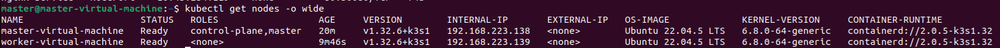
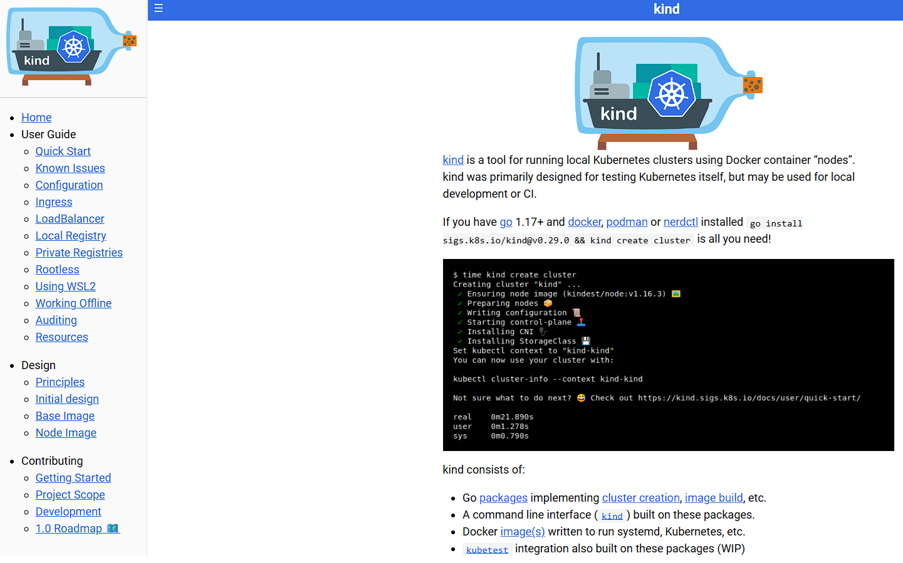
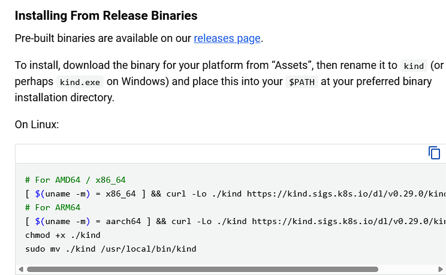
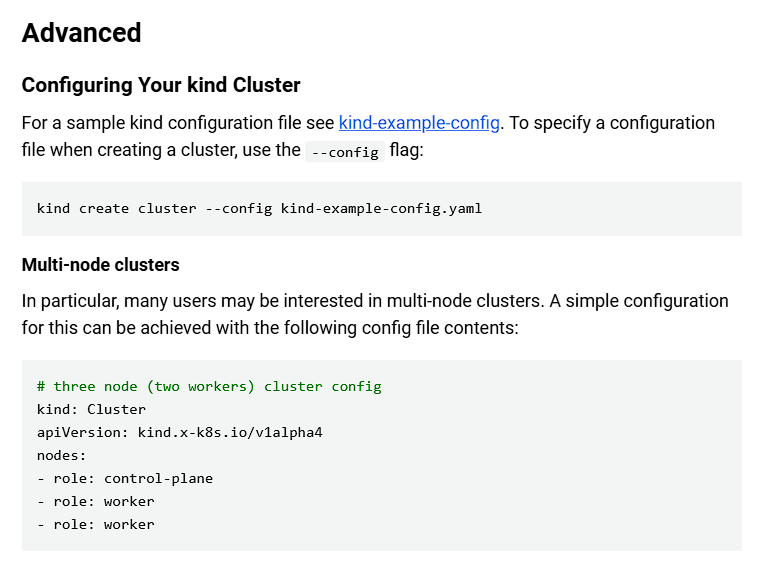
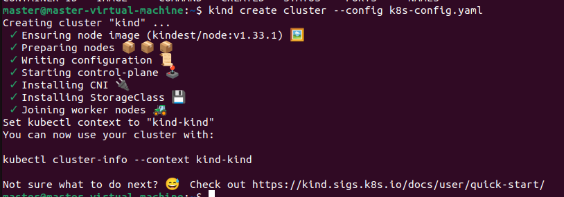
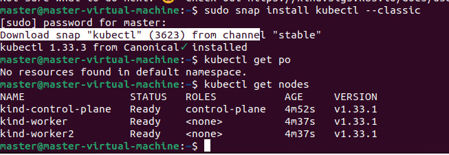
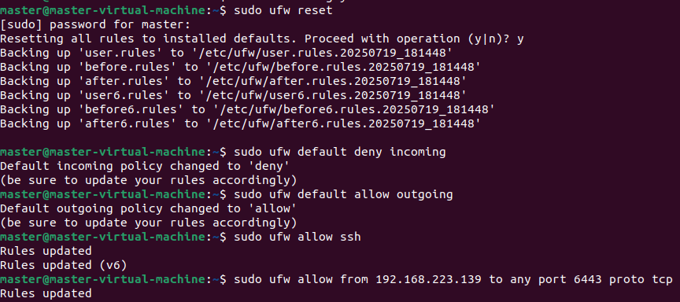
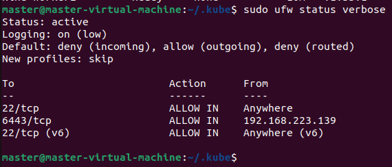
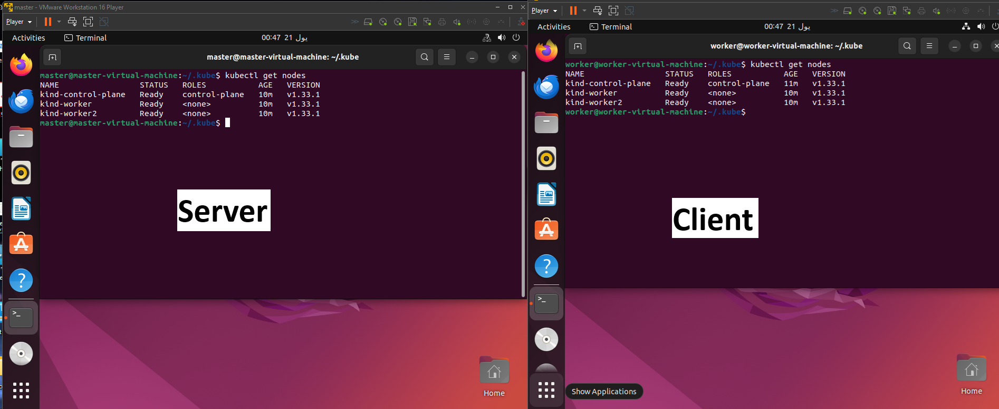

# installing kubernetes cluster using k3s on Ubuntu 🚀

1.1 Update System Packages
```
sudo apt update && sudo apt upgrade -y
```

1.2 Disable Swap Memory
```
sudo swapoff -a
sudo sed -i '/ swap / s/^\(.*\)$/#\1/g' /etc/fstab
```

1.3 Configure Firewall
```
# Allow SSH (if you're connecting via SSH)
sudo ufw allow OpenSSH

# Allow K3s server port (6443) for API communication
sudo ufw allow 6443/tcp

# Allow Flannel (K3s's default CNI) VXLAN traffic (UDP 8472)
sudo ufw allow 8472/udp

# If you plan to deploy applications that expose NodePort services,
# you might need to open the NodePort range (e.g., 30000-32767/tcp)
# sudo ufw allow 30000:32767/tcp

# Enable the firewall (if not already enabled)
sudo ufw enable

# Verify UFW status
sudo ufw status verbose
```

2.1 Install K3s Server both (worker and master)
```
curl -sfL https://get.k3s.io | sh -
```

2.2 Get the K3s Join Token

```
sudo cat /var/lib/rancher/k3s/server/node-token
```
note: we will use it later to join the nodes to the Master

2.3 Configure kubectl Access (on Master Node)
```
mkdir -p $HOME/.kube
sudo cp /etc/rancher/k3s/k3s.yaml $HOME/.kube/config
sudo chown $(id -u):$(id -g) $HOME/.kube/config
chmod 600 $HOME/.kube/config
```

2.4 Verify Cluster on Master Node
```
kubectl get nodes
```

3.1 Install K3s Agent on Nodes

```
curl -sfL https://get.k3s.io | K3S_URL=https://<Master_IP>:6443 K3S_TOKEN=<K3S_TOKEN> sh -
```
3.2 Verify K3s Agent Status on Nodes
```
sudo systemctl status k3s-agent
```

a screenshot of final output



# installing kubernetes cluster using Kind on Ubuntu 🚀
in this documentation I will show you the steps of creating a cluster using kind locally and allowing access for a specific IP to the APIServer and run commands on the Master

### Prerequisites
- 2 VMs ubuntu 22.04 installed on them
- Docker installed on the server
- kubectl installed on both

## Installation 💻
1- go to the web site for kind https://kind.sigs.k8s.io/



2- go to installation part and use the link to you're system 



3- create a configuration file as shown but add the VM IP as apiServerAddress under networking in the config file on the server



4- then run the kind create command to create the cluster [1 master,2 nodes] on the server



5- install kubectl to check if the nodes are up and running on the server



6- create a ufw rols to allow only access from the client VM IP address to allow the connection between the client to the server on the server



7- check the ufw status to check the roles created on the server



8- copy the configuration file from the $HOME/.kube/config on the server to the $HOME/.kube/config to be able to connect 
9- run any kubectl command to check the connectivity 


